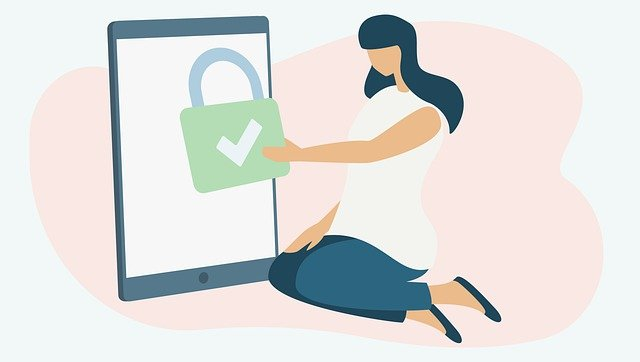
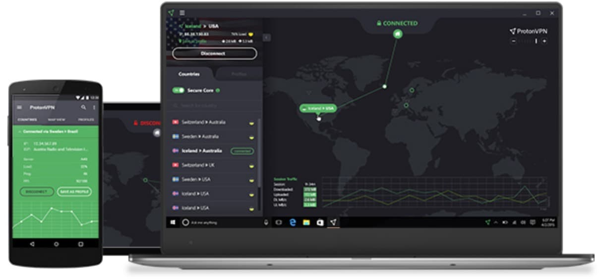

A segurança e a privacidade está cada vez mais em foco nos dias atuais, principalmente por mudanças de leis e pela preoucupação das próprias pessoas usuárias da Internet.

<!--truncate-->

Quando falamos de privacidade e segurança, já vem em mente o uso de uma VPN para cuidar de nossos dados pessoais. Porém, esse tipo de assunto é sempre delicado e vou tentar tratar hoje com muita transparência e mostrando o que eu utilizo quando necessário.

## O que é VPN?

Para conseguirmos entender esse post, primeiro precisamos saber o que é uma VPN e como funciona esse serviço.

Uma VPN nada mais é que uma rede privada para acesso a dados. Grandes empresas utilizam VPN's para, por exemplo, permitir o acesso de computadores de funcionários a seus sistemas. Mas também, se tornou muito popular as VPN's para usuários finais acessarem a Internet. O conceito é o mesmo, utilizamos uma rede privada para acessarmos uma rede pública e termos acesso a informação que queremos.

Resumindo, acessamos uma rede privada segura, utilizando criptografia em muitos casos, e a partir dessa rede, acessamos a Internet. Por meio dessa conexão podemos garantir a nossa privacidade, pois podemos utilizar conexões criptografadas, acessar conteúdos bloqueados em determinadas regiões, manter o anonimato (em vários casos) e ainda, mas é muito difícil, aumentar a velocidade da conexão a determinados conteúdos.

## Ok, qual usar?

Bom, agora que já sabemos, resumidamente, o que é uma VPN, qual devemos utilizar para uso pessoal?

No mercado existem várias a disposição, mas o importante é sabermos onde os servidores dessa VPN estão hospedados. Ou seja, de nada adianta queremos manter nossos dados seguros, anônimos e privados e escolhermos uma VPN que tem a sua sede nos EUA ou no REINO UNIDO. ([Recomendo a leitura sobre as Alianças](https://pt.vpnmentor.com/blog/paises-dos-cinco-olhos-ou-novo-olhoscatorze-olhos-crucial-para-os-usuarios-de-vpn-entenderem/)).

Outro ponto que pesa é a questão do preço, como vivemos no Brasil, o uso de uma VPN se torna bem pesado para o nosso bolso. Se formos comparar os planos de 3 anos, a NordVPN se torna a mais interessante de se utilizar, pois além de custar menos que as rivais, tem a sua localização no PANAMA. 

Nós temos também a opção de utilizar uma VPN gratuita, porém, TOME MUITO CUIDADO COM ISSO. Muitas VPN's gratuitas coletam seus dados e revendem, indo no caminho contrário do que muitas pessoas querem ao utilizar uma VPN. Mas, nem tudo está perdido. Recentemente, a [ProtonVPN](https://protonvpn.com/pt_br/) se tornou Open Source e disponibilizou o seu plano mais básica de forma gratuita. Esse movimento foi muito importante pois no mundo corporativo das VPN's, não temos serviços que nos entreguem já tudo pronto para utilizar e isso pode gerar uma boa mudança nos serviços disponibilizados.

Outro ponto interessante da ProtonVPN é ter seus servidores na Suiça, país esse que não faz parte das Alianças e não interfere na privacidade dos dados. O último ponto que me deixa tranquilo para utilizar essa VPN é a confiabilidade que a empresa Proton Technologies passou e criou ao longo dos anos. Para quem não conhece, a Proton é a empresa mantenedora do ProtonMail, reconhecido pela criptografia e confiabilidade quanto a privacidade e segurança.

## Finalização

Agora fica em suas mãos, no meu dia a dia eu acabo utilizando a ProtonVPN quando necessito de uma conexão com mais privacidade ou quando estou em um lugar que não confio na conexão disponibilizada.

Creio que existam coisas mais importantes para quem quer se proteger do que somente usar uma VPN e continuar utilizando o Google para pesquisas, por exemplo.

Uma VPN pode te proteger como também pode te causar dores de cabeça, então utilize com cuidado e tenha em mente qual o serviço que você está utilizando, além de ter ciência que seus dados não estarão 100% protegidos e seguros.

// see you later
