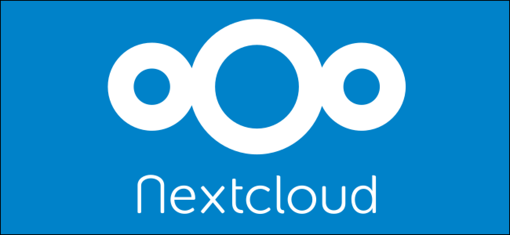

Cada vez mais é difícil armazenar dados e confiar em serviços que prometem privacidade e segurança, além de disponibilidade. Vivemos em um mundo tecnológico onde alguns serviços oferecem planos gratuitos, mas, será que esses serviços são bons e confiáveis para armazenarmos nossos dados? Pensando nisso, estou escrevendo esse post para mostrar como é a estrutura e como guardo meus arquivos pessoais.

Eu, particularmente, sou muito apegado a privacidade e segurança, optando por buscar utilizar ferramentas e serviços que sejam livres (Software Livre). Isso não só me da total controle dos meus dados como também abre portas para personalização e adaptação conforme o meu uso diário.

Dada essa introdução, vamos falar hoje, basicamente, sobre o [Nextcloud](https://nextcloud.com/), uma nuvem livre que permite uma expanção gigantesca que me atende muito bem nas minhas tarefas. É importante frizar que eu tenho um vídeo lá no canal [ROVEEb](https://www.youtube.com/roveeb) onde falo como montar um servidor próprio utilizando [Nextcloud](https://nextcloud.com/) + Docker + Let's Encrypt, tudo isso de maneira rápida e fácil. Lá também você poderá encontrar um vídeo falando sobre os principais aplicativos que sua nuvem precisa ter.

<iframe width="100%" height="630" src="https://www.youtube.com/embed/48rYcegMWgc" title="YouTube video player" frameborder="0" allow="accelerometer; autoplay; clipboard-write; encrypted-media; gyroscope; picture-in-picture" allowfullscreen></iframe>

Falando um pouco de história, o [Nextcloud](https://nextcloud.com/) nasceu de um fork do ownCloud e criado por Frank Karlitschek, um dos fundadores do [ownCloud](https://owncloud.com/). Esse fork se deu pois o [ownCloud](https://owncloud.com/) alterou suas políticas, seu foco e sua visão sobre o software, dando foco para o comercial e deixando de lado a cultura do Software Livre. Nascia então, o [Nextcloud](https://nextcloud.com/) como conhecemos atualmente.

Mas, por que usar o [Nextcloud](https://nextcloud.com/)? Vou ser bem sincero, eu não confio muito em serviços como o [Google](https://drive.google.com) ou [Dropbox](https://www.dropbox.com/pt_BR/), pois por mais que possuam uma grande fatia do mercado e se mostram um tanto quanto confiáveis perantes a ataques para roubo de informações, seus termos de serviço são confusos e complexos, deixando brechas abertas para venda de dados para empresas que eu não gostaria que tivessem minhas informações. Além disso, o [Nextcloud](https://nextcloud.com/) me permite personalizar utilizando aplicativos desenvolvidos pela comunidade, o que aumenta a sua gama de funcionalidades.

Hoje em dia, meu servidor está rodando em uma VPS da [Contabo](https://contabo.com/), pois além de estar em um país razoável para privacidade, tem um preço acessível e atende muito bem as minhas necessidades. Por motivos de estudos, não estou rodando a aplicação utilizando Docker, mas utilizei e utilizo, em instalações para parceiros que realizei, esse repositório que foi citado no começo do post.

O [Nextcloud](https://nextcloud.com/) não utiliza muitos recursos do meu servidor, a não ser quando utilizo um dos aplicativos, o OnlyOffice, para editar planilhas ou apresentações. No mais, seu uso não ultrapassa os 500MB de memória (monitoramento que realizei).

Essa possibilidade de instalar aplicativos é maravilhosa, porém também é necessário ter cuidado com o que se está instalando a mais, pois pode causar problemas de segurança, privacidade ou até mesmo de desempenho. Existem alguns aplicativos que eu acho fundamentais de se ter instalados e que me ajudam a aumentar a minha produtividade e evolução em tarefas. Entre os aplicativos que eu não vivo sem posso citar: 
- [Two-Factor TOTP Provider](https://github.com/nextcloud/twofactor_totp#readme): Esse aplicativo me permite habilitar a autenticação em duplo fator na minha instância, o que do ponto de vista da segurança, é algo essencial e que SEMPRE deveria ser utilizado.
- [OnlyOffice](https://www.onlyoffice.com/): É um aplicativo que me permite utilizar o Office de maneira online, ou seja, tenho um servidor (pode ser usando o Document Server) rodando e me conecto a ele utilizando o OnlyOffice, dessa forma, posso editar planilhas, apresentações e textos de forma 100% online. É um aplicativo que está evoluindo e possuí varias funcionalidades.
- [Notes](https://github.com/nextcloud/notes): Troquei o Joplin por ele, mantenho instalado o aplicativo no meu celular e edito as notas pela Web, um excelente aplicativo para manter, classificar e criar notas. Tem suporte a Markdown, o que, basicamente, nos permite fazer qualquer tipo de nota.
- [Deck](https://github.com/nextcloud/deck): Troquei o Trello a pouco tempo por essse aplicativo, principalmente para controlar meus fluxos de leitura e de tarefas pessoais a realizar. Tem alguns pontos a melhorar, como por exemplo data de término do cartão, capas e alguns bugs que fui encontrando. Fora isso, é um excelente aplicativo e está atendendo muito bem o que preciso fazer no meu dia a dia.
- [News](https://github.com/nextcloud/news): Esse app pode não servir de serventia para algumas pessoas, mas eu não vivo sem. Com ele, coloco os feeds dos sites que são minhas fontes de informação e de um lugar, consigo ler todas as notícias de maneira simples. 
- [Keeweb](https://github.com/jhass/nextcloud-keeweb): Eu utilizo o KeePass para gerenciar minhas senhas. As vezes, preciso logar rapidinho em algum lugar na Web para pegar uma senha de um serviço ou algo parecido, então, com o Keeweb consigo abrir meu banco de dados, alterar minhas senhas e fazer praticamente tudo o que faço com os aplicativos KeePassXC e Keepass2Android.
- [Contacts](https://github.com/nextcloud/contacts#readme): Meus contatos estão todos salvos nesse aplicativo, tem algumas questões a melhorar, mas no mais, cumpre com seu proprósito e não tenho mais medo de perder meus contatos após trocar de celular ou de chip.
- [Calendar](https://github.com/nextcloud/calendar/): Como o próprio nome já diz, um calendário. Ele se integra com o Deck e o Tasks e tem algumas funcionalidades interessantes. A um bom tempo tornou-se meu calendário principal.
- [Mail](https://github.com/nextcloud/mail#readme) e [RainLoop](https://github.com/pierre-alain-b/rainloop-nextcloud): Aplicativos para e-mail. O primeiro, Mail, é um dos aplicativos destaques do [Nextcloud](https://nextcloud.com/). Sua interface meio que se "integra" ao [Nextcloud](https://nextcloud.com/), ficando mais bonito em sua visualização. Tem alguns pontos que precisam melhorar e por isso estou testando o RainLoop, que é um Webmail já conhecido e essa integração com o [Nextcloud](https://nextcloud.com/) está me deixando bem satisfeito.

#### Caso você queira ver um pouco mais sobre aplicativos, tenho esse vídeo onde abordamos esse assunto

<iframe width="100%" height="630" src="https://www.youtube.com/embed/ZbqiFASh6KM" title="YouTube video player" frameborder="0" allow="accelerometer; autoplay; clipboard-write; encrypted-media; gyroscope; picture-in-picture" allowfullscreen></iframe>

Além da nuvem, mantenho meus dados em um HD Externo, como forma de backup caso ocorra algum tipo de problema com a minha nuvem (nunca se sabe quando isso irá acontecer). Alguns dos planos que tenho para o futuro é armazenar o backup em um bucket, porém, minhas condições financeiras ainda não permitem essa liberdade e esse gasto.

Para finalizar, o [Nextcloud](https://nextcloud.com/) é uma excelente solução comercial, podendo fazer você ganhar um bom dinheiro com sua instalação e suporte. Além disso, para uso pessoal, pode ser divido com amigos, onde você pode cobrar por contas a fim de custear o servidor. O mais interessante disso, além da privacidade e do controle dos seus dados, é que você tem total controle sobre personalizações, podendo deixar do seu gosto e necessidades.

E ai, como você guarda suas informações?

// see you later